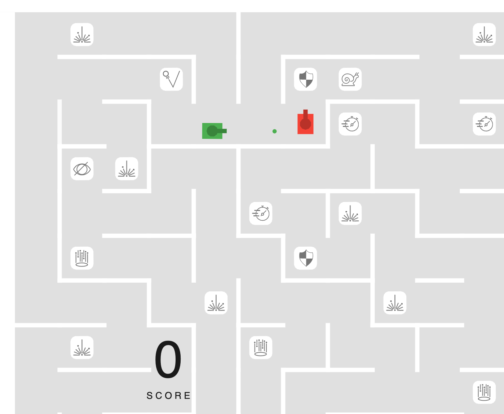

# tank-mayhem

A multiplayer web physics game inspired by Tank Trouble

*Note*: This is a work in progress as you can probably tell.

This project was heavily inspired by a game me and my buddies used to kill time with in class, called Tank Trouble (also known as AZ Tank Game). It is definitely from the early Flash days of the internet, and you were supposed to share one keyboard and one computer to play against each other. I decided to take it a step further and recreate the game by taking advantage of the latest capabilities of the web today.

## Try it

[tankmayhem.com](https://tankmayhem.com)
